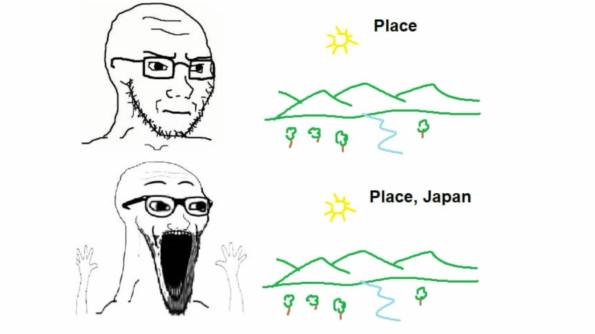

# vaibu 雰囲気

> 普通の写真　→　日本の美学



Turn any photo into a Japanese aesthetic one. Based on the meme above.

## Features

- **4 presets** — 幽玄 yugen / 桜 sakura / 城 shiro / 夜 yoru
- **Film-style color grading** — warmth, lifted blacks (fade), teal shadows, hue shift
- **Film grain** — pixel-level noise overlay
- **Vignette**
- **Sakura petals** — vector, randomized per render
- **Text overlay** — 4 styles (jp-serif, mono, BIG, stamp), 7 positions, 6 colors, size & opacity
- **Download** as JPEG

## Usage

No build step. No dependencies. Open `index.html` in a browser.

```
vaibu/
├── index.html
├── style.css
├── app.js       # upload, state, UI controls
└── filters.js   # Canvas pixel manipulation & drawing
```

## How it works

All processing happens client-side via the Canvas 2D API:

1. Image is drawn to `canvasBefore`
2. On every change, `applyVaiburu()` copies pixels to `canvasAfter` and runs:
   - Per-pixel color grade (saturation → warmth → teal shadows → fade → hue rotation)
   - Film grain (random noise per pixel)
   - Vignette (radial gradient)
   - Sakura petals (vector ellipses)
   - Optional text overlay
   - Watermark stamp
3. Download exports `canvasAfter` as JPEG

## License

MIT
